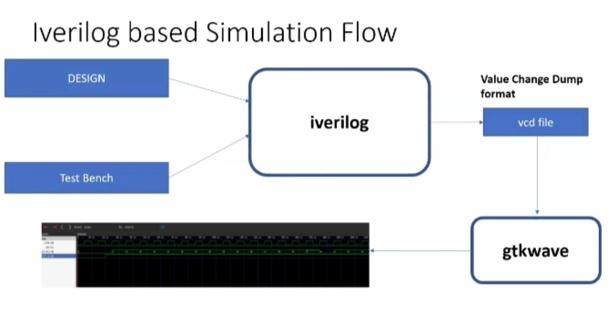

# Task 1 - Introduction to iVerilog

In this first subdivision of week 1, I was introduced to open-source simulators, specifically **iVerilog**, which we’ll use for our RTL designs throughout the program.

---

## 🎯 What I Learned
During this session, I learned:

- What a simulator is and its purpose in verifying RTL designs.
- The concepts of **design** and **testbench (TB)**.
- How a simulator evaluates inputs and produces outputs.
- The role of **primary inputs** and **outputs** in a design.
- The basic **iVerilog simulation flow**.

---

## 🔹 Simulator
A simulator is a tool used to check if the RTL design behaves as intended.

- We used **iVerilog** as the simulator.
- It monitors input signals, and only when an input changes, it recalculates the outputs.
- If there is no change in input, outputs remain the same.

> **Note:**  
> A design can have multiple primary inputs and outputs, but a **testbench** does not have any primary inputs or outputs.

---

## 🔹 Design and Testbench
- **Design:** The actual RTL code written to meet specifications.  
- **Testbench (TB):** Used to verify if the design works correctly by providing inputs and observing outputs.

---

## 🔹 Simulator Workflow
The simulator works in an **event-driven** manner:

1. It observes all input signals.  
2. When an input changes, outputs are updated.  
3. If there’s no change, the outputs stay the same.  

---

## 🔹 iVerilog Simulation Flow
Below is the flow diagram we looked at:

📷 *iVerilog Simulation Flow 

---

## 📝 Notes
- TB does not have primary inputs or outputs.  
- Designs may have one or more primary inputs and outputs depending on the specifications.  
- Simulator evaluation is triggered only by input changes, which makes the process efficient.
