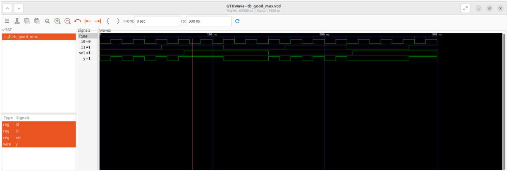
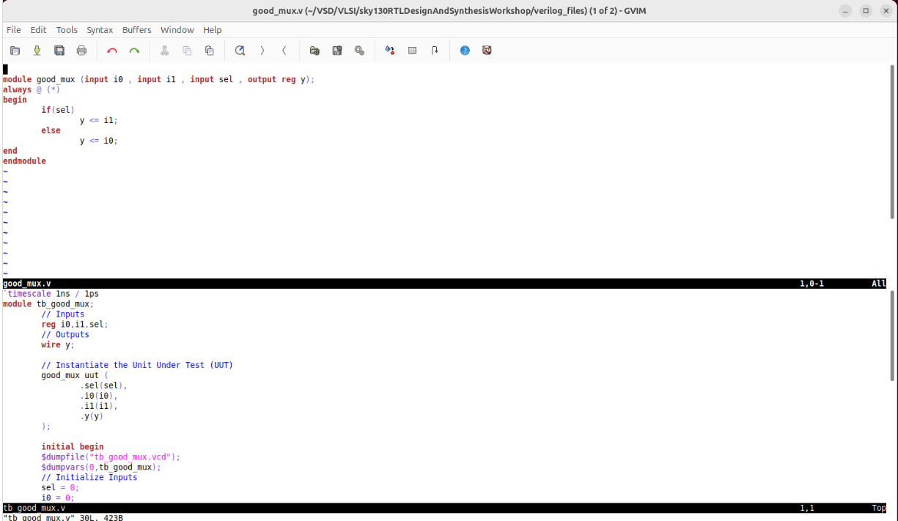

2. Labs using iVerilog & GTKwave
In this subdivision, I worked on practical labs using iVerilog and GTKwave to simulate and verify RTL designs.

🎯 What I Learned
During these sessions, I learned:

How to organize my workspace by creating a VSD folder and a VLSI subfolder for lab files.
How to clone a GitHub repository containing the Sky130 RTL designs (from Kunal Ghosh sir) and explore its contents.
How to use iVerilog to compile and simulate a design module along with its testbench.
How to generate a VCD file from the simulation and visualize the output using GTKwave.
How to analyze module and testbench files using gvim.
🔹 Lab Setup
Created the following folder structure on my machine:
VSD -> VLSI
Cloned the Sky130 RTL repository (https://github.com/kunalg123/sky130RTLDesignAndSynthesisWorkshop.git) into the VLSI folder.
Explored the repository files to understand the organization and RTL modules.

🔹 Simulation with iVerilog
Took the example mux design: good_mux.v
Used the testbench: tb_good_mux.v
Simulated using the command:
iverilog  good_mux_tb good_mux.v tb_good_mux.v  ## create executable file (a.out)
./a.out ## dump the vcd file and create tb_good_mux.vcd
gtkwave tb_good_mux.vcd ## Used to view the waveform
🔹 Viewing Results in GTKwave
I opened the generated VCD file in GTKwave to visualize the output.

I observed how input changes affected the output, verifying that the design worked correctly.

🔹 File Analysis
In the second part of the lab, I analyzed the module and testbench files using gvim.

I learned how to navigate through the code and understand signal connections and behavior.

Screenshot: gvim showing mux module code and tb

Gvim Mux Code

📝 Notes
The general commands to create a executable file of a design and run the simulation using iVerilog and gtkwave are:

iverilog  < module_name.v > < testbench_name.v >
./a.out
gtkwave < testbench_name.vcd >
## Task 2 Results

### Verilog Code (good_mux.v and tb_good_mux.v)

### Simulation Output (GTKWave)

