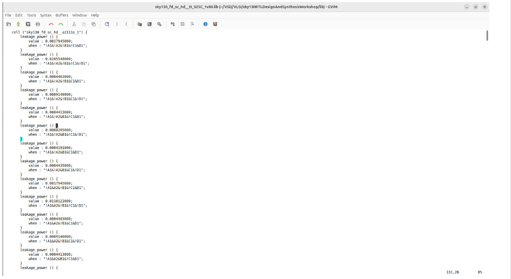

# Introduction to Timing Libraries

##  What I Explored
For this topic, I worked with the **Sky130 RTL library** provided in *Kunal Ghosh sir's GitHub repo*.

I explored the timing library files, looked into their contents, and understood how they describe:

- Standard cells  
- Leakage power  
- Area  

---

## ✨ Key Learnings

### 📌 Library Naming Convention
The name of the library itself encodes three important factors:

```
sky130_fd_sc_hd__tt_025C_1v80.lib
```

- **TT** → Typical process  
- **025C** → Temperature = 25°C  
- **1v80** → Voltage = 1.8V  

These three (Process, Voltage, Temperature) are critical for a silicon chip to function reliably.

**Analogy:**  
Think of toasting bread — every time you toast it, the result is slightly different.  
In the same way, fabrication introduces variations in silicon.  
A chip must still work across all such corners.

📸 *Screenshot: sky130 library file*  
📸 *.lib1 file Screenshot* 


📸 *.lib2 file Screenshot* 



---

## 🧩 Exploring Cells in the Library
The library contains buckets of cells like:

- AND, OR, NAND, NOR  
- Inverters, Buffers, etc.  

I also analyzed the equivalent **Verilog models** of these cells.

**Command used to analyse verilog model:**
```vim
:sp <relative_path>.behavioral.v
```

---

## 📝 Example – Analyzing an AND Cell
I specifically opened an **AND2 cell** and explored details like leakage power.

**Command used:**
```vim
:sp <relative_path>/sky130_fd_sc_hd__a2111o.behavioral.v
```

---

## ⚡ Comparing Different AND Cell Variants

| Cell Name | Area (Relative) | Speed   | Notes                                   |
|-----------|-----------------|---------|-----------------------------------------|
| AND2_0    | Smallest        | Slowest | Less area, higher delay                 |
| AND2_2    | Medium          | Balanced| Trade-off between area and delay        |
| AND2_4    | Largest         | Fastest | Wider transistors, less delay           |

**Key Insight:**
- Larger area → faster cells (due to wider transistors).  
- Smaller area → slower cells (but area-efficient).  

📸 *Screenshot: Comparison of different flavours of AND cells*  
📸 *AND cell Screenshot*  

---

## ✅ Wrap-Up
From this lecture, I understood:

- How PVT variations are captured in library file names.  
- How to view the equivalent Verilog models of cells.  
- How different cell variants trade off between **area and performance**.  

This gave me a strong foundation on how **timing libraries drive the behavior, area, and delay characteristics** of standard cells.
