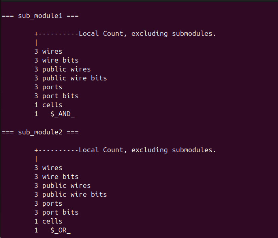
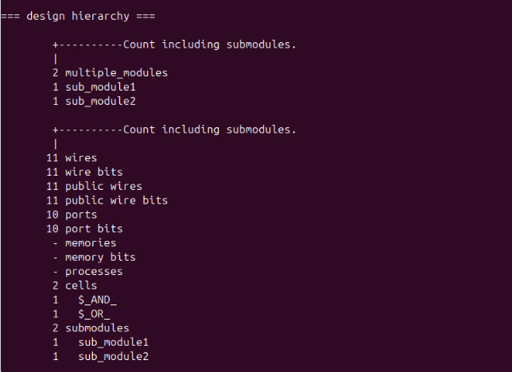
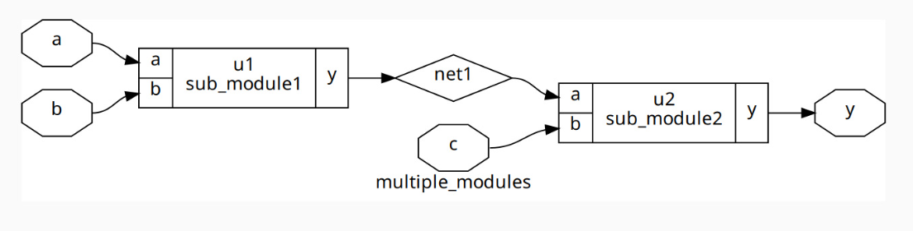
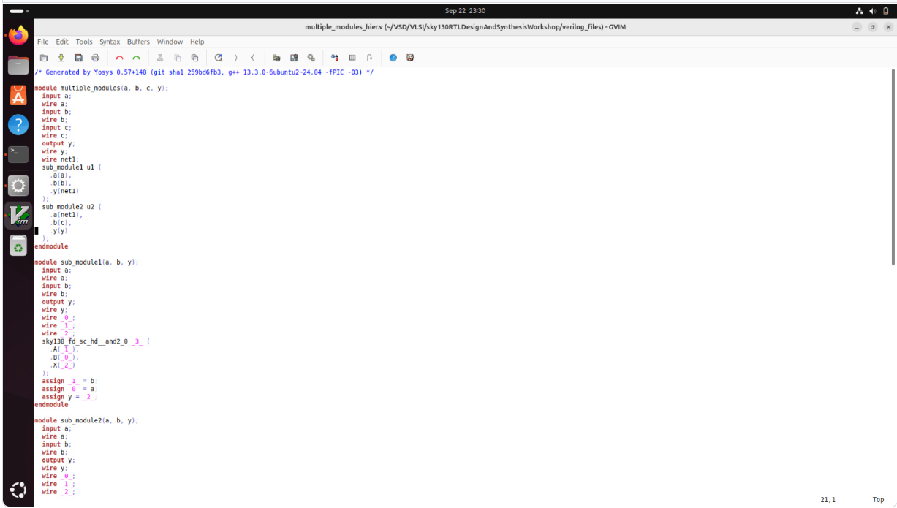
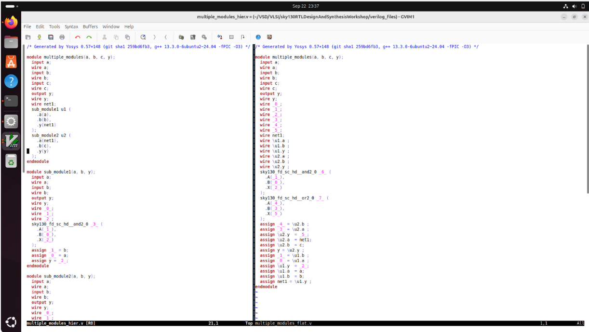

# 📘 Hierarchical vs Flat Synthesis

## 🔍 What I Learned
I explored the difference between **Hierarchical** and **Flat Synthesis** approaches in digital design.  

I practiced synthesizing a multi-module design and observed how hierarchy affects the resulting netlist structure.

Key observations:
- **Hierarchical Synthesis** preserves module structure, improving readability and modular verification.  
- **Flat Synthesis** merges all modules into a single top-level module, enabling global optimization but reducing readability.  
- **Submodule-level synthesis** allows synthesizing specific modules for large designs or repeated modules.

---

## ✨ Key Concepts

### 📌 Hierarchical Synthesis
- Each module is synthesized separately according to the design hierarchy.  
- Maintains the module structure in the netlist, improving readability and modular verification.  
- Preferred when designs have multiple instances of the same module or for a divide-and-conquer approach.

### 📌 Flat Synthesis
- All modules are flattened into a single top-level module during synthesis.  
- Maximizes global optimization but results in a large, less readable netlist.  
- Useful for smaller designs or when module hierarchy is not needed.

### 📌 Modulable / Submodule-level Synthesis
- Synthesizes only specific submodules using:
```bash
synth -top <module_name>
```

---

## ⚙️ How to do Hierarchical Synthesis
```tcl
read_liberty -lib ../lib/sky130_fd_sc_hd__tt_025C_1v80.lib
read_verilog <module_name.v>
synth -top <module_name>
abc -liberty ../lib/sky130_fd_sc_hd__tt_025C_1v80.lib
show
```

- `read_liberty` → Reads the standard cell library (.lib) for synthesis. Provides timing, area, and power info.  
- `read_verilog` → Loads your Verilog RTL code into the tool.  
- `synth -top` → Synthesizes RTL to gate-level netlist; `-top` specifies top-level module.  
- `abc -liberty` → Performs technology mapping using ABC.  
- `show` → Displays a graphical view of the synthesized netlist.

---

## 📝 Example – Hierarchical Synthesis Flow
For design `multiple_modules.v`:
```tcl
read_liberty -lib ../lib/sky130_fd_sc_hd__tt_025C_1v80.lib
read_verilog multiple_modules.v
synth -top multiple_modules 
abc -liberty ../lib/sky130_fd_sc_hd__tt_025C_1v80.lib
show multiple_modules
write_verilog -noattr multiple_modules_hier.v
!gvim multiple_modules_hier.v
```

📸 *Screenshot: module level synthesising is shown*  

 


📸 *Graphical representation of multiple_modules*


📸 *Hierarchical Netlist file screenshot* 



**Observation:** Hierarchy is maintained, showing submodules clearly.

---

## 📝 Example – Flat Synthesis Flow
```tcl
write_verilog -noattr multiple_modules_flat.v
!gvim multiple_modules_flat.v
```

📸 *Screenshot: comparison of heir vs flat netlist file* 



**Observations:**
- All modules are merged into a single file.  
- No hierarchy is preserved.  
- Useful for global optimization, but harder to read.

---

## ⚡ Why Submodule-level Synthesis is Needed
Submodule-level (modulable) synthesis is useful to synthesize only specific modules.

**Key Reasons:**
1. **Multiple Instances of the Same Module** → Isolate and optimize independently.  
2. **Divide and Conquer for Large Designs** → Handle smaller parts individually to manage complexity.

**Command used:**
```bash
synth -top <module_name>
```

**Key Takeaways:**
- Hierarchical Synthesis keeps module structure intact, aiding readability, verification, and divide-and-conquer synthesis.  
- Flat Synthesis merges all modules for maximum optimization but sacrifices readability.  
- Submodule-level synthesis allows control over which modules to synthesize, helpful for large or repetitive designs.
