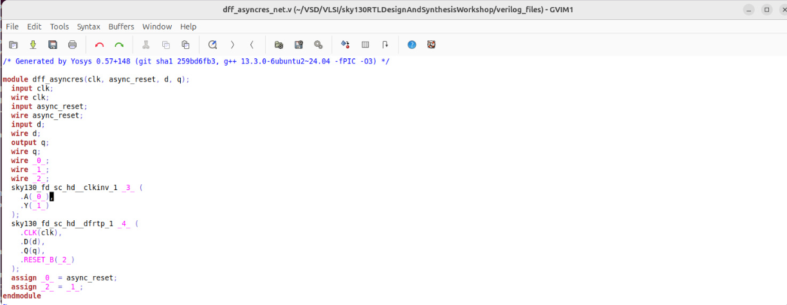
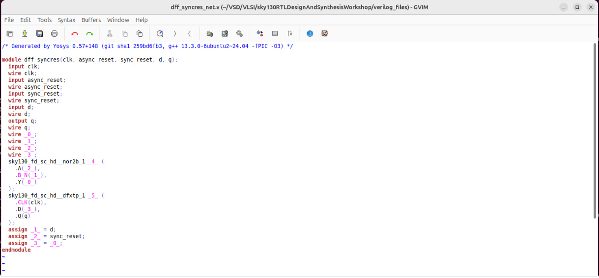
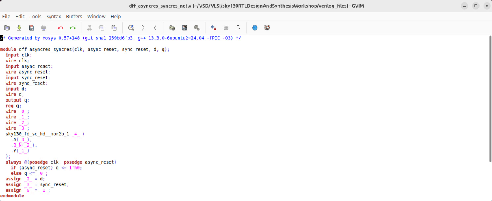
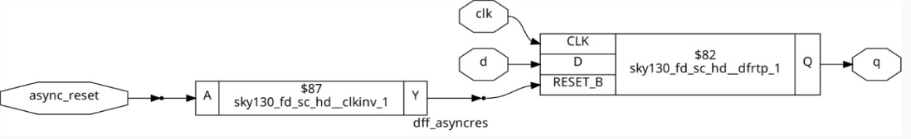
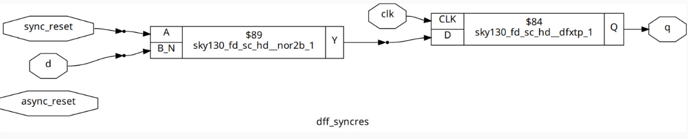
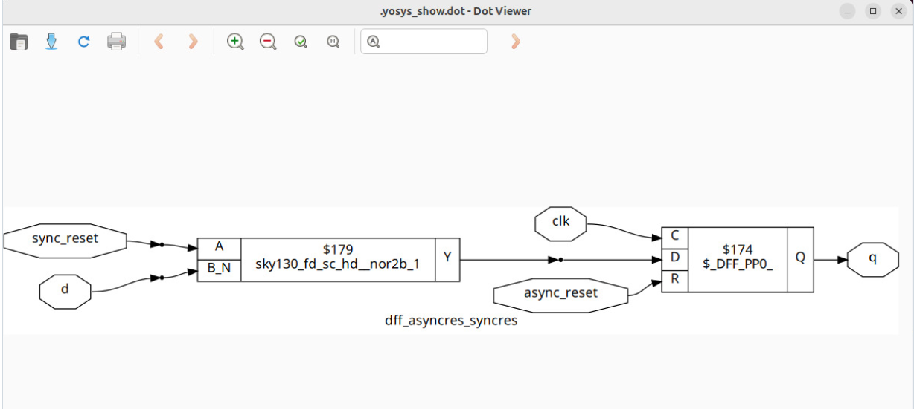

# 📘 Various Flop Coding Styles and Optimizations

## 🔍 What I Learned
Flip-flops are used to store stable outputs and avoid glitches in combinational circuits.  

Key learnings:
- Difference between **synchronous** and **asynchronous resets**, and implementation in Verilog.  
- Designing **combined reset strategies** for flexibility.  
- Optimization techniques for multiplications using **shift-based methods** in Verilog.

📸 *Simulation Screenshot*  
📸 *Synthesized Netlist file Screenshot*  

📸 *Graphical Representation of Reset Strategies*  

  

---

## ✨ Key Concepts

### 🔹 Combinational Circuits and Glitches
- Combinational circuits produce outputs solely based on current inputs.  
- Large combinational circuits are prone to **glitches** (momentary 0s or 1s due to propagation delays).  
- Flip-flops act as storage elements, triggering only on the clock edge to provide **stable outputs**.  
- Flip-flops must be initialized with a reset to avoid **garbage values**.

### 🔹 Flip-Flop Reset Strategies

**Asynchronous Reset**  
- Triggered independent of the clock.  
- Immediately sets or resets the flip-flop when activated.

**Synchronous Reset**  
- Triggered only on the active edge of the clock.  
- Reset occurs **in sync** with the clock.

**Combined Reset**  
- Designs can include both synchronous and asynchronous resets for flexibility.  
- All three cases were simulated, and outputs were observed.  

---

## ⚡ Optimization Techniques – Multiplication Modules

Shift-based optimizations reduce hardware requirements for multiplication operations.

### MULT_2 Module
- Input: `A` (3-bit)  
- Output: `Y = 2 * A`  
- Achieved by **left-shifting by 1 bit**.  
- Output width: 3-bit input → 4-bit output.

### MULT_9 Module
- Input: `A` (3-bit)  
- Output: `Y = 9 * A = 8*A + A`  
- Implemented by **concatenating A shifted left by 3 bits (A*8) and adding A**.  
- Example: 3-bit input → 6-bit output: `Y = {A_shifted, A}`.

**Key Insight:**  
No hardware multipliers are required; wires and concatenation are sufficient.  
Reduces hardware complexity, resource usage, and improves RTL efficiency.

---

## ✅ Key Takeaways
- Flip-flops ensure **stable outputs** and prevent glitches in combinational circuits.  
- Proper reset strategies guarantee **predictable initialization**.  
- Shift-based multiplication optimizations **eliminate the need for actual multipliers**, reducing hardware resources.  
- Understanding these coding styles and optimizations helps in writing **efficient RTL** for digital circuits.
