# Day 2: Combinational Logic Optimization

In this subdivision, we focused on combinational logic optimization.  
We mainly worked with the OPT files (`OPT-check.v`, `OPT-check2.v`, `OPT-check3.v`, `OPT-check4.v`, etc.), along with their corresponding relog files.

The main idea was to perform constant propagation and simplify the designs into basic logic gates.

---

## Files Overview

- `OPT-check.v` → Simplifies into an AND gate  
- `OPT-check2.v` → Simplifies into an OR gate  
- `OPT-check3.v` → Simplifies into a 3-input AND gate  
- `OPT-check4.v` → Used for Lab Experiment 1  
- `multiple_module_OPT.v` → Used for Lab Experiment 2  

We also learned about multiple modules in `multiple_module_OPT.v` where different blocks are optimized individually.

---

## Command for Constant Propagation

Before running ABC mapping, we must perform constant propagation with:

```bash
opt_clean -purge
```

This ensures redundant constants are removed and optimization happens properly.

---

## OPT-check.v (AND Gate)

**Verilog Screenshot:**  
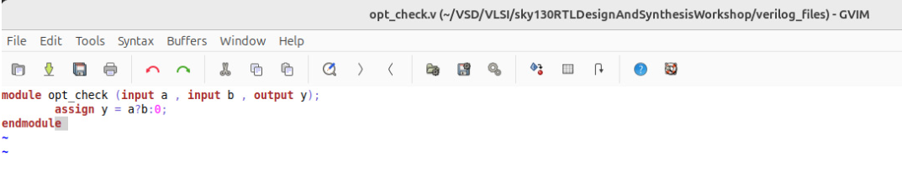


**Synthesis Log:**  
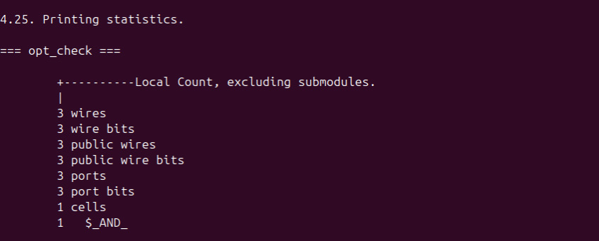

As the Verilog code shows, it is a multiplexer; the synthesizer optimized it into an AND gate.

**Graphical Representation:**  
*Screenshot goes here*
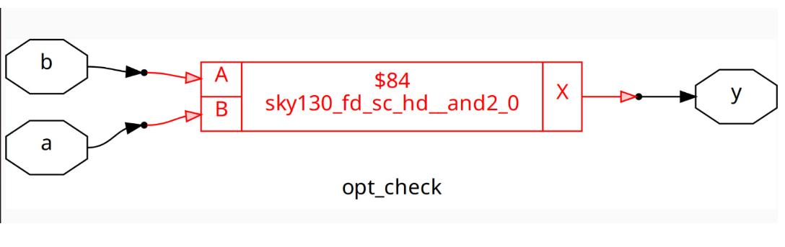

---

## OPT-check2.v (OR Gate)

**Verilog Screenshot:**  
*Screenshot goes here*


**Synthesis Log:**  
*Screenshot goes here*
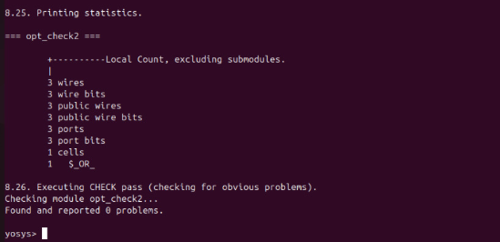

Here the design is simplified into an OR gate.

**Graphical Representation:**  
*Screenshot goes here*
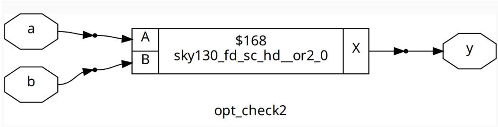
---

## OPT-check3.v (3-input AND Gate)

**Verilog Screenshot:**  
*Screenshot goes here*
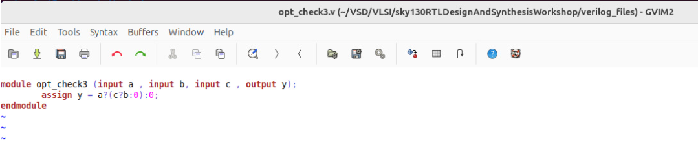

**Synthesis Log:**  
*Screenshot goes here*
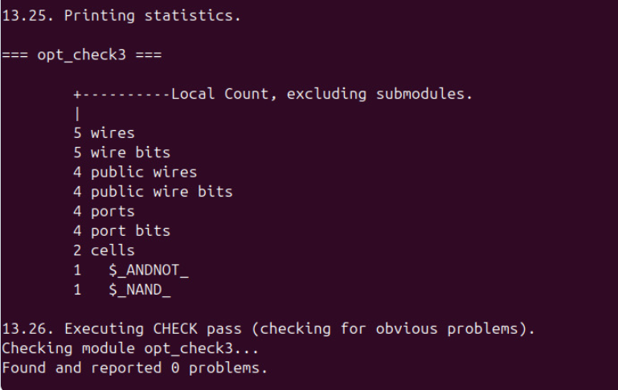

Here the design is simplified into a 3-input AND gate.

**Graphical Representation:**  
*Screenshot goes here*
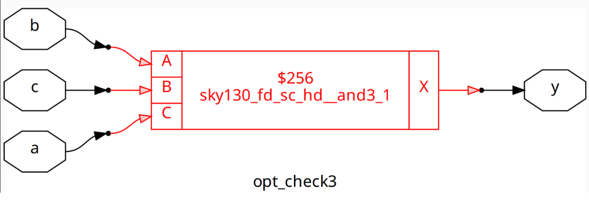

---

## Lab Experiments

### Lab 1 – OPT-check4.v

Experimenting with combinational block.  

- Applied constant propagation + synthesis  
- Observed how redundant logic gets reduced to a minimal form

**Verilog Screenshot:**  
*Screenshot goes here*
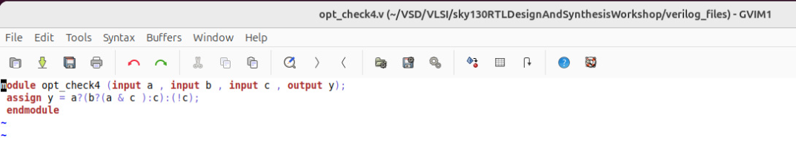

**Synthesis Log:**  
*Screenshot goes here*
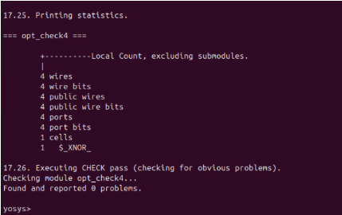

The design is simplified into an XNOR gate.

**Graphical Representation:**  
*Screenshot goes here*
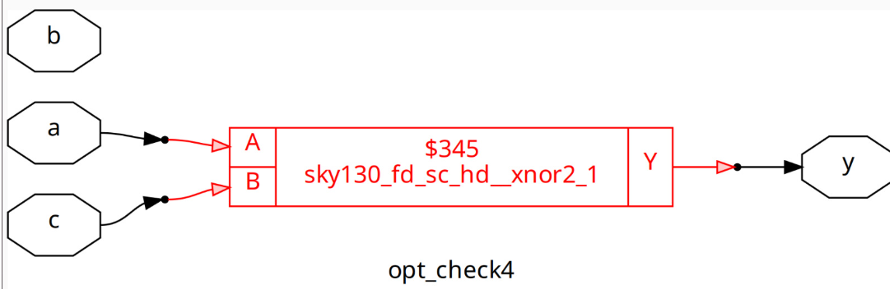

---

### Lab 2 – multiple_module_OPT.v

Contains multiple modules that interact.

- Applied `opt_clean -purge` before ABC mapping  
- Each module was optimized independently

**Verilog Screenshot:**  
*Screenshot goes here*


**Synthesis Log:**  
*Screenshot goes here*
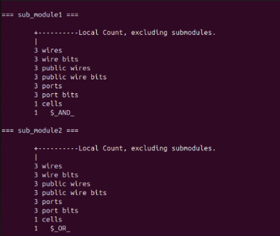

**Graphical Representation:**  
*Screenshot goes here*
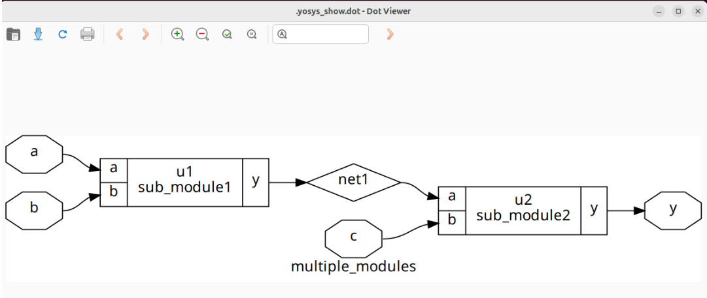

---

## Key Learning

- Combinational optimization is achieved using constant propagation  
- `opt_clean -purge` is mandatory before `abc -liberty` command for proper optimization  
- Complex-looking Verilog simplifies into basic logic gates after optimization  
- Multiple modules can be optimized separately, reducing redundancy
