# 3. Sequential Logic Optimization

In this subdivision, we focused on **sequential logic optimization** in digital design. We analyzed and synthesized several D flip-flop (DFF) based modules with constant inputs, observing how the synthesis tool (like Yosys) optimizes redundant logic.

---

## What I Learned

- **Sequential constant propagation** is highly effective in removing redundant flip-flops when outputs are constant.
- Synthesis tools can optimize DFF-based modules into simpler logic (like **wires**) if possible, significantly **saving area**.
- Observing synthesis statistics and graphical representation helps me understand how the tool interprets my Register-Transfer Level (RTL) code.
- Understanding sequential optimization helps me write more efficient RTL for state machines and memory elements.

---

## Files Analyzed

We performed Verilog code analysis, synthesis, and studied the graphical representation of each design for the following files:

- `dff_const1`
- `dff_const2`
- `dff_const3`

---

## Detailed File Analysis

### dff_const1

**Observation:** Standard DFF; the output genuinely depends on the input.

The synthesizer prints DFFs correctly.

**Key Learnings:**
- Confirms correct mapping of flip-flops from RTL.
- Useful for sequential logic verification.

*Screenshot: Verilog Module*
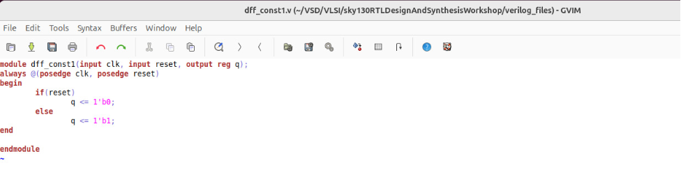

*Screenshot: Synthesis Statistics*
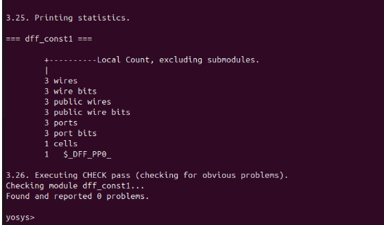

> **Note:** Here there is no possibility of optimizing the design, hence **1 DFF** is used.

*Screenshot: Graphical Representation*
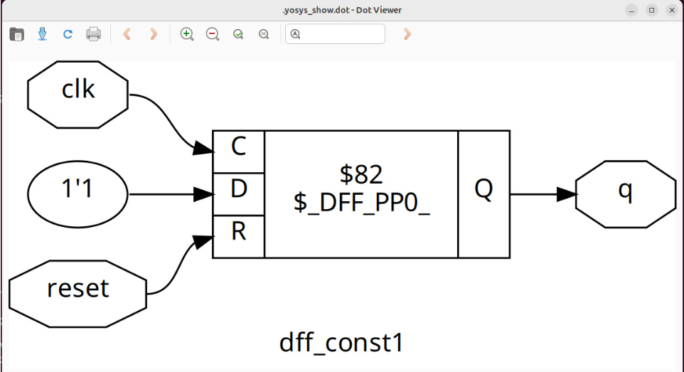

---

### dff_const2

**Observation:** Output is always logic '1' regardless of data inputs or reset.

The synthesizer optimized the logic into a **wire**, and no DFFs were printed in the output.

**Key Learnings:**
- Sequential constant propagation successfully removes redundant flip-flops.
- Recognizing constant outputs helps simplify the design down to a static wire.

*Screenshot: Verilog Module*
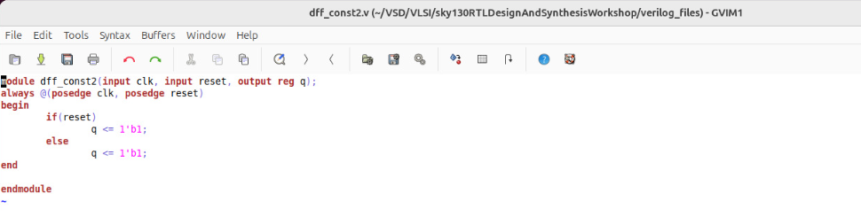

*Screenshot: Synthesis Statistics*
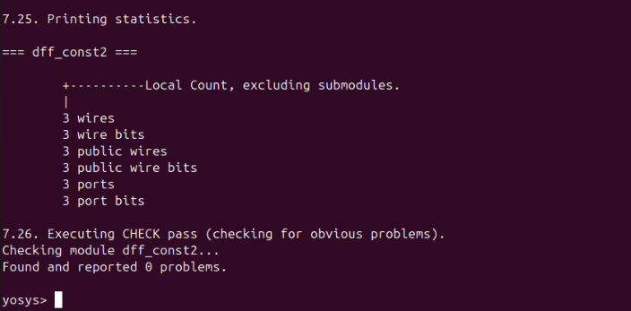

> **Note:** Here the DFF's output is always logic '1', independent of input and reset. Hence, the DFF is optimized into a **logic '1' wire**.

*Screenshot: Graphical Representation*
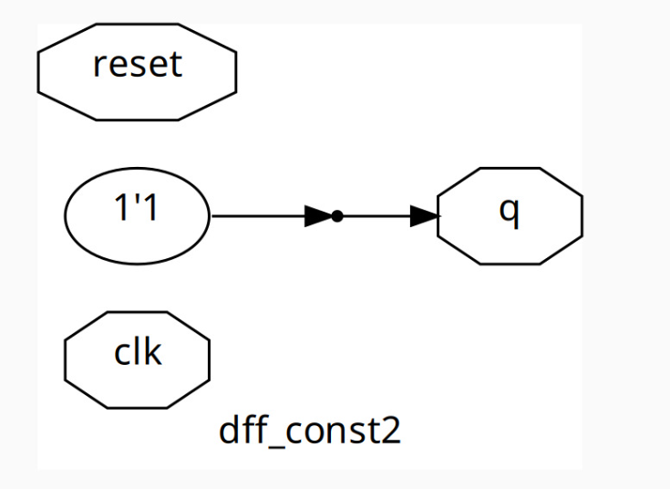

---

### dff_const3

**Observation:** Similar to `dff_const2`; constant output should be optimizable.

**However,** the synthesizer result shows the design **can't be fully optimized**, and **2 Flip-Flops** are required.

**Key Learnings:**
- This is an important counter-example showing designs *must* be analyzed carefully to understand synthesis limits.

*Screenshot: Verilog Module*
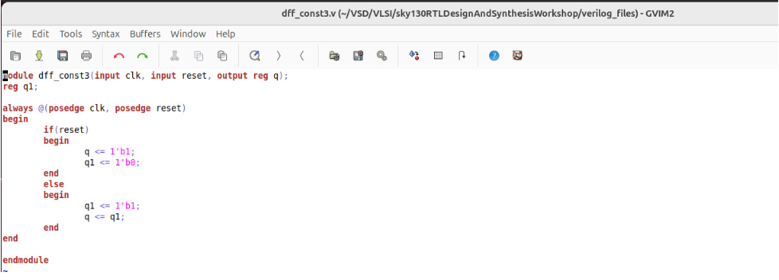

> **Note:** The design requires 2 Flip Flops.

*Screenshot: Synthesis Statistics*
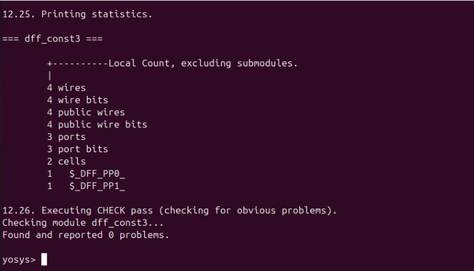

> **Note:** The printing statistics proved that the design requires **2 Flip Flops** and couldn't be optimized.

*Screenshot: Graphical Representation*
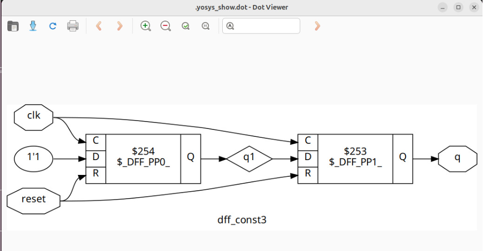

---

## Lab Experiments

### Lab 1 – dff_const4

Performed analysis and synthesis for sequential optimization. Redundant flip-flops were removed wherever possible.

*Screenshot: Verilog Module*
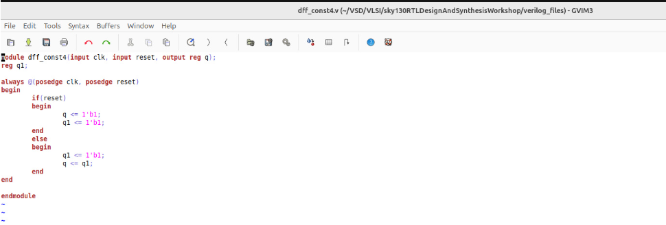

> **Observation:** In this module, irrespective of the clock and reset, the outputs `q` and `q1` will stay at logic '1'. Hence, we don't need any flip-flops to store the value; a simple **logic '1' wire** is sufficient.

*Screenshot: Synthesis Statistics*
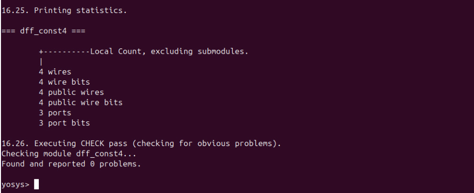

> **Result:** The synthesis stats proved **no hardware (FF)** is needed. The design was completely optimized by the synthesizer (Yosys).

*Screenshot: Graphical Representation*
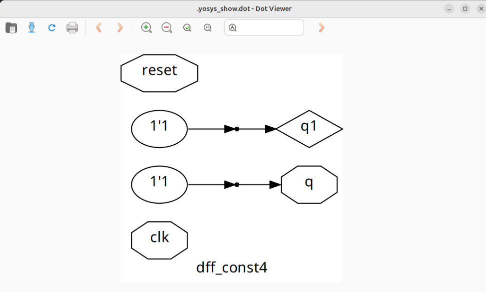

---

### Lab 2 – dff_const5

Similar analysis and optimization goal as `const4`.

*Screenshot: Verilog Module*
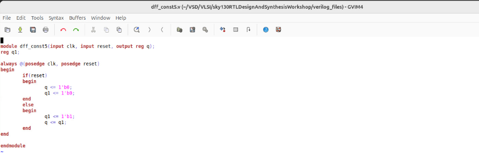

> **Observation:** From the module, it is clearly seen that the design **can't be optimized** because the output *depends* on the reset condition: when reset is applied, both the outputs `q1` and `q` become '0'; when reset is '0', both outputs become '1'. So, we need **2 flip-flops** to store the output.

*Screenshot: Synthesis Statistics*
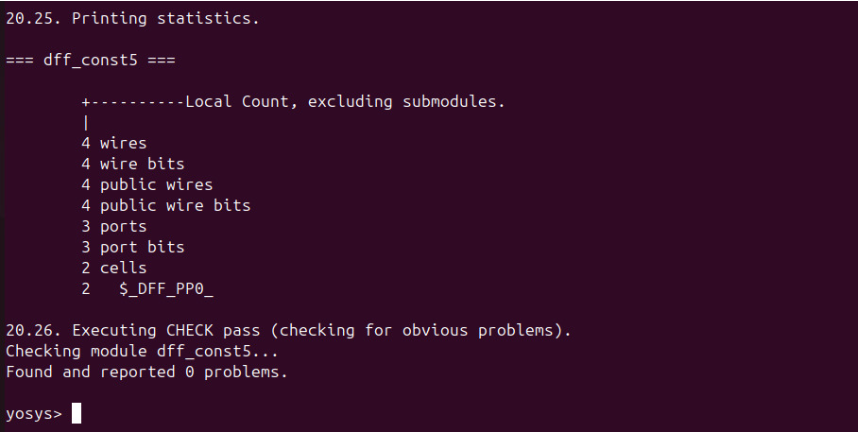

> **Result:** Our synthesizer proved that **2 flops** are necessary for this design. Hence, **no optimizations were made**.

*Screenshot: Graphical Representation*
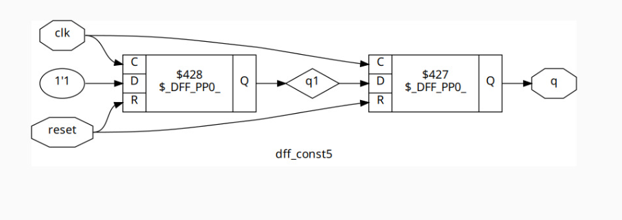