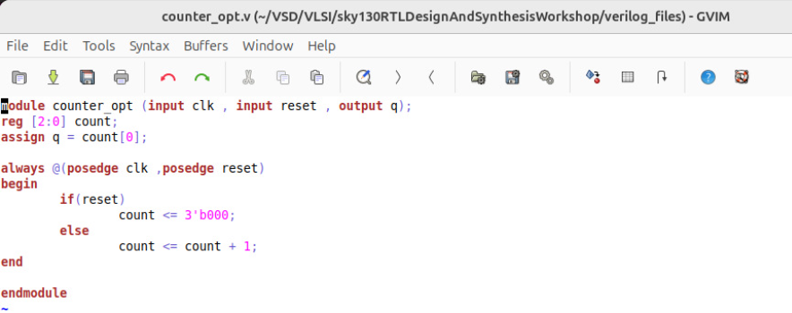
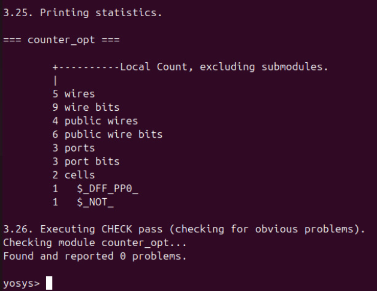
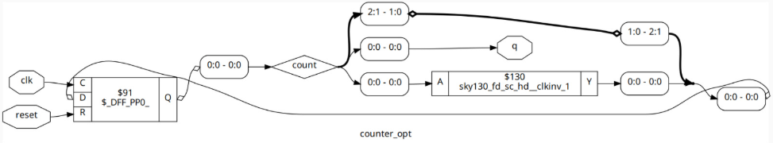
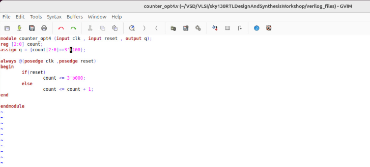
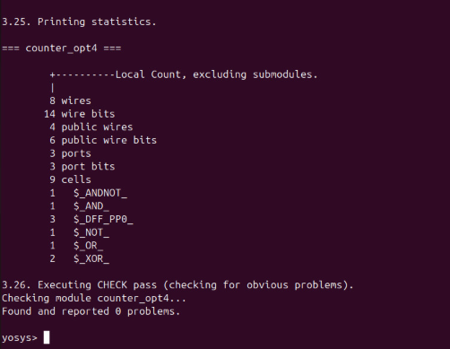
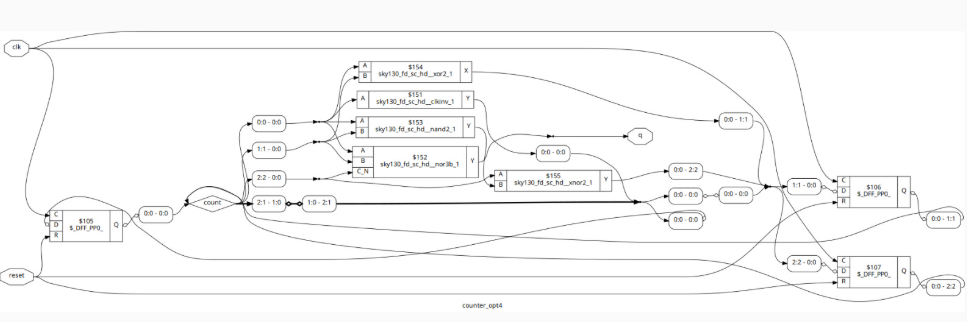

# 4. Sequential Optimization for Unused Outputs

## Overview

In this subdivision, we focused on **unused output optimization** in sequential circuits. We analyzed a **counter module** to observe how synthesis tools identify and optimize flip-flops whose outputs are not connected or utilized.

We performed Verilog simulation, code analysis, and synthesis, and studied the graphical representation to understand how unused outputs are handled.

---

## File Analyzed

- `counter_opt.v` – A 3-bit counter module used for detailed analysis.

---

## Detailed Analysis: counter_opt.v

### Case 1 – Only LSB Used

**Observation:**
The counter’s output depends **only on the Least Significant Bit (LSB)**, `count_0`. The other Most Significant Bit (MSB) outputs are unused.

**Synthesis Result:**
The synthesizer optimized the 3-bit design down to a **single flip-flop with an inverter**, effectively removing the redundant MSB flip-flops.

*Screenshot: Verilog Module*

> **Note:** In this code, the final output `q` depends only on the LSB (`count[0]`) but not the other two bits.

*Screenshot: Synthesis Statistics*

> **Result:** The need for 3 flip-flops was reduced to 1 flop and an inverter. The unused logic/outputs were successfully optimized.

*Screenshot: Graphical Representation*

**Key Learnings:**
- Sequential optimization can remove unused logic and outputs, leading to significant **area reduction** and **power savings**.
- Even if a module *defines* multiple flip-flops, only the **essential logic** is retained after aggressive optimization.

---

### Case 2 – All Outputs Used

**Observation:**
The counter output is configured to use all bits (e.g., `100`), meaning **all three flip-flops are utilized** and necessary for the final output.

**Synthesis Result:**
The synthesizer **did not perform any optimization** since all outputs were functional and required for the final result.

*Screenshot: Verilog Module*

> **Note:** Here the output `q` depends on all 3 bits of the counter.

*Screenshot: Synthesis Statistics*

> **Result:** 3 flip-flops are used, and no optimizations can be done. This design cannot be optimized by the synthesizer.

*Screenshot: Graphical Representation*

**Key Learnings:**
- Unused output optimization only occurs when certain outputs are truly redundant or unconnected.
- Synthesis tools retain all flip-flops if their outputs are functional and necessary to meet the design requirements.

---

## Overall Key Learning from This Subdivision

- Sequential optimization tools are smart enough to **detect unused outputs** and remove redundant flip-flops from the final netlist.
- Optimizing unused outputs directly reduces **area**, **power consumption**, and **routing congestion** in the final hardware.
- It’s crucial to **identify which outputs are actually used** in your design to help the synthesis tool achieve the most efficient optimization possible.