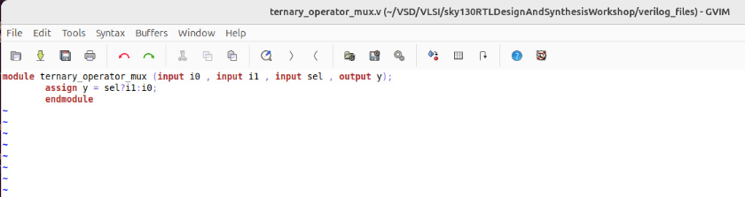
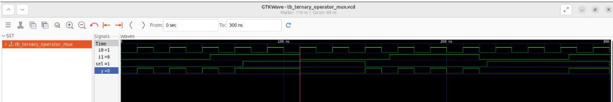
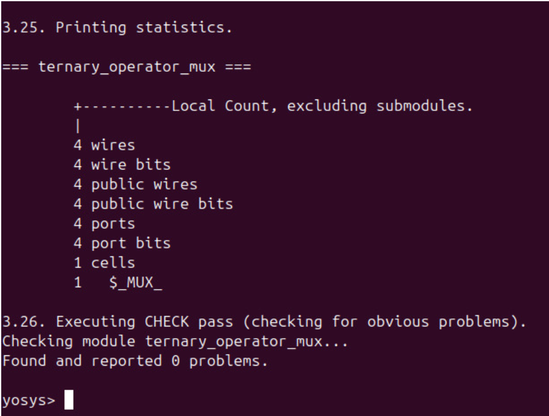
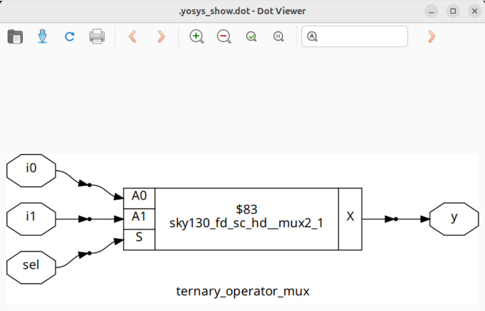
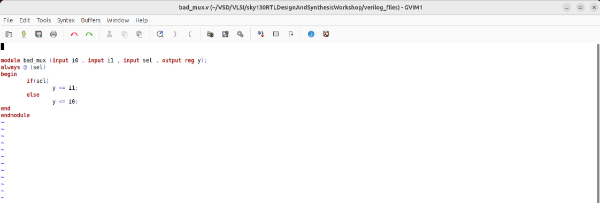
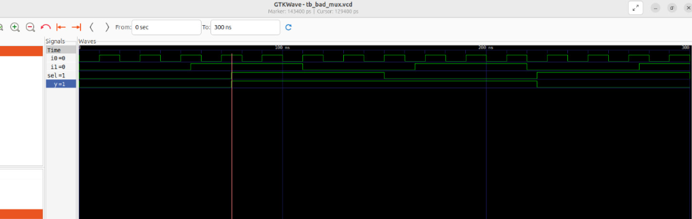
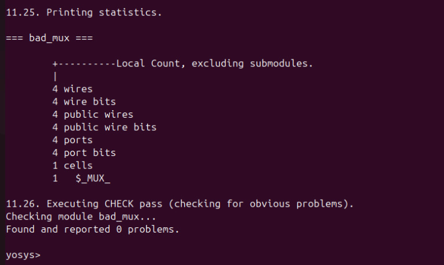
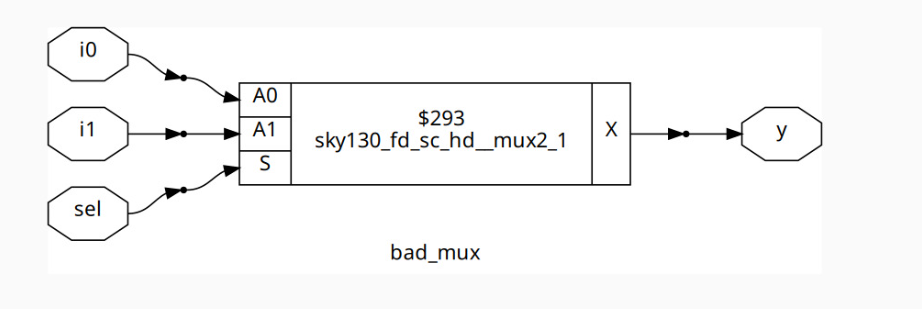

# 📘 Day 2 - Labs on GLS & Synthesis-Simulation Mismatch

In this subdivision, we performed **hands-on labs** to understand how **GLS (Gate-Level Simulation)** helps detect **synthesis-simulation mismatches**.  

We used the following files:
- `ternary_operator_mux.v`
- `bad_mux.v`
- `good_mux.v`

---

## 🧪 1. Lab Procedure

### 🔹 Simulate the RTL
- First, we simulated `ternary_operator_mux.v` at the **RTL level**.
- Verified its logical correctness before synthesis.

### 🔹 Synthesize the Design
- Generated the **gate-level netlist** for the design.

### 🔹 Gate-Level Simulation (GLS)
To perform GLS, we invoked **iVerilog**:

```bash
iverilog ../my_lib/verilog_model/primitives.v ../my_lib/verilog_model/sky130_fd_sc_hd.v <module_name_net.v> <testbench_name.v>
```

Generate the simulation executable:
```bash
./a.out
```

To see the waveform:
```bash
gtkwave <testbench_name.vcd>
```

---

## 🔎 Analysis of `ternary_operator_mux.v`

1. **RTL Code Screenshot:**  



2. **RTL Simulation Waveform:**  


3. **Synthesized Printing Statistics:** 


4. **Graphical Representation:**  


➡️ `ternary_operator_mux.v` is the **efficient way** of coding a **2:1 MUX**.  
The RTL simulation works correctly for this design.

---

## 🔎 Analysis of `bad_mux.v`

1. **RTL Code Screenshot:**  


2. **RTL Simulation Waveform:**  


3. **Synthesized Printing Statistics:**  


4. **Graphical Representation:**  


➡️ `bad_mux.v` is a **bad coding style**, because:
- It only reacts to changes in the sensitivity list `sel`.  
- Inputs `i0` and `i1` do not affect the output when they vary.  
- Thus, the **MUX behavior is incorrect** and leads to **synthesis-simulation mismatch**.

---

## 📌 Observations

- GLS uses the **gate-level netlist** as the **Design Under Test (DUT)**.  
- Any mismatches between **RTL simulation** and **gate-level behavior** can be caught here.  
- This lab shows **why GLS is essential before layout**:  
  Small RTL issues can appear as major **functional errors** at the gate level.

---
