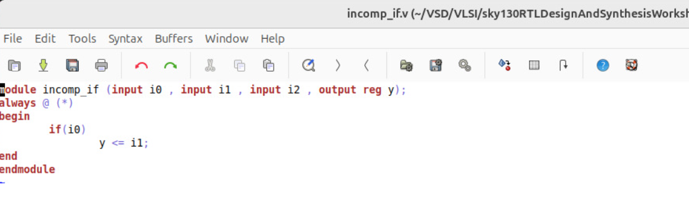

# Day 5 - Optimization in Synthesis
## Subdivision 2: Labs on Incomplete If-Case

This document explains the second subdivision of Day 5 - Optimization in Synthesis.  
In this section, we performed **hands-on labs** to understand how incomplete if statements behave during simulation and synthesis.

---

## What I Learned
- Writing incomplete if statements causes the synthesizer to **infer latches**, which is not good practice.  
- RTL simulation alone may not reveal hardware issues — **synthesis analysis is also important**.  
- Always complete the if-else structure to ensure predictable and optimized hardware.  
- Good coding style directly impacts the quality of synthesized circuits.  

---

## Files Used
- `incomp_if.v`  
- `incomp_if2.v`  

These files contain examples of **incomplete if statements**.  

---

## Concept: Incomplete If Statement
An **incomplete if** occurs when an `else` branch is missing.  
- In **synthesis**, this results in **inferred latches** because the output retains its previous value when no condition is true.  
- This is considered a **bad coding style** and should be avoided.  

---

## 1. Example 1 – `incomp_if.v`

### Code Analysis
The Verilog source code clearly shows missing else conditions.  

📄 **Verilog Code (incomp_if.v)**  

### RTL Simulation
We first ran an RTL simulation to observe the output behavior of the incomplete if statements.  

📸 **RTL Simulation Result**  
  

- If `i0` is high, the output `y` exactly follows `i1`.  
- If `i0` goes low, the output is **confused** — it latches into the **previous value** of `y` until `i0` becomes `1`.  

### Synthesis Printing Statistics and Graphical View
After synthesis, we observed that the synthesizer inferred **latches** to hold the output when conditions were not met.  

📊 **Printing Statistics**  

- The stats show that the mux becomes a **D-Latch**, as expected.  
- Improper coding style leads directly to latch inference.  

📈 **Graphical View**  

---

## 2. Example 2 – `incomp_if2.v`

### Code Analysis
The Verilog source code clearly shows missing else conditions.  

📄 **Verilog Code (incomp_if2.v)**  

### RTL Simulation
We then ran RTL simulation again.  

📸 **RTL Simulation Result 2**  

- Here also the **else condition is missing**.  
- To work as intended, the **enable condition** of the latch becomes `~(i0 + ~(i2))`.  
- Otherwise, the output `y` will **latch into its previous value**.  

### Synthesis Printing Statistics and Graphical View
After synthesis, the synthesizer again inferred **latches**.  

📊 **Printing Statistics**  

- The stats also confirmed the **presence of a latch**.  

📈 **Graphical View**  
 

---

## Observations
- Incomplete if statements result in **latch inference**.  
- **Simulation may still run correctly**, but synthesis introduces additional hardware (latches) to hold values.  
- To avoid this: **Always write complete if-else statements**.  

---
