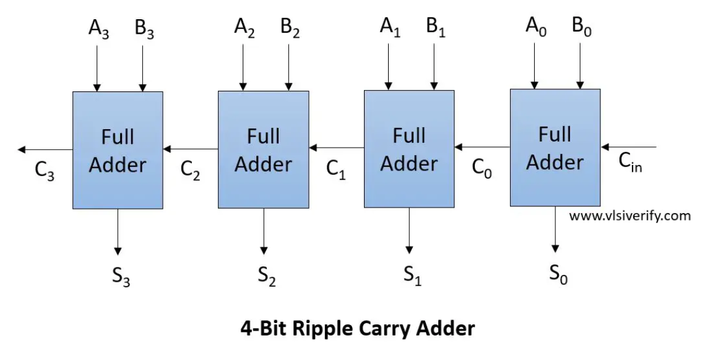

# Day 5 – For-Loops and For-Generate

This document explains the **fourth subdivision of Day 5 - Optimization in Synthesis**.  
In this section, we studied the two looping constructs in Verilog: **for-loops** and **generate for-loops**.

---

## Types of Looping Constructs

### For Loop
- Always used **inside an `always` block**.  
- Mainly for evaluating expressions or iterating over conditions.  
- **Cannot instantiate hardware.**  
- Example use case: creating logic for MUX/DEMUX.  

### Generate For Loop
- Used **outside of the always block**.  
- Specifically meant for **instantiating hardware multiple times**.  
- Very useful when the same module needs to be repeated.  
- Example use case: **Ripple Carry Adder**, where multiple full adders are instantiated.  

---

## Syntax

### For Loop (inside always block)
```verilog
always @(*) begin
  integer i;
  for (i = 0; i < N; i = i + 1) begin
    // Expression evaluation logic
  end
end
```

### Generate For Loop (outside always block)
```verilog
genvar i;
generate
  for (i = 0; i < N; i = i + 1) begin : label_name
    module_name instance_name (...);
  end
endgenerate
```

---

## Example: Ripple Carry Adder with Generate For

Suppose we want to design an 8-bit ripple carry adder.  
Instead of instantiating 8 full adders manually, we can use a **generate for-loop**:

```verilog
genvar i;
generate
  for (i = 0; i < 8; i = i + 1) begin : adder_stage
    full_adder FA (.a(A[i]), .b(B[i]), .cin(carry[i]), .sum(S[i]), .cout(carry[i+1]));
  end
endgenerate
```

Here, the full adder module is instantiated **8 times automatically**.  
This saves repetitive coding and ensures **clean, scalable hardware design**.

**Screenshot of 4-bit Ripple Carry Adder:**  

 

---

## Observations
- **For Loops**: Good for **behavioral modeling** inside always blocks.  
- **Generate For Loops**: Best for **structural modeling** and **hardware replication**.  
- Both are essential in writing **scalable and reusable Verilog code**.  

---

## What I Learned
- There are two distinct looping constructs in Verilog: **for** and **generate for**.  
- A **for loop** is useful for expressions and logic evaluation but cannot replicate hardware.  
- A **generate for loop** is used for **hardware replication**, making designs like ripple-carry adders simple and scalable.  
- Using generate constructs avoids repetitive instantiations and leads to **cleaner code**.  
- The difference between the two is **crucial for both simulation and synthesis optimization**.  

---

## For vs Generate For

| Aspect              | For Loop (inside always)         | Generate For Loop (outside always) |
|---------------------|----------------------------------|-------------------------------------|
| **Location**        | Used inside an always block      | Used outside always, in generate block |
| **Purpose**         | Expression evaluation / behavioral logic | Hardware instantiation / structural logic |
| **Hardware Creation** | Does not instantiate hardware   | Can instantiate multiple hardware modules |
| **Common Use Cases** | MUX, DEMUX, iterative expressions | Ripple Carry Adder, array of modules |
| **Flexibility**     | Simulation-oriented              | Synthesis-oriented, scalable hardware |
| **Example**         | Looping for signal assignment    | Repeated instantiation of full adders |

---
