# Day 5 – Subdivision 5: Labs on For Loop and For-Generate 🔄

In this final subdivision of **Day 5**, we analyzed the use of the `for` loop and `for-generate` constructs in Verilog for iterative assignments and structural hardware instantiation.

We explored the following modules:
* `fa.v` – Full Adder module
* `rca.v` – Ripple Carry Adder (RCA) using `for-generate`
* `mux_generate.v` – Multiplexer design using `for-generate`
* `demux_generate.v` – Demultiplexer design using `for-generate`
* `demux_case.v` – Demultiplexer design using a standard `case` statement

---

## 1. Ripple Carry Adder (RCA) Implementation

The Ripple Carry Adder (RCA) demonstrates the power of `for-generate` for repetitive structural instantiation.

### Full Adder (FA)

The base building block, implemented in `fa.v`.

RTL Code of Full Adder:
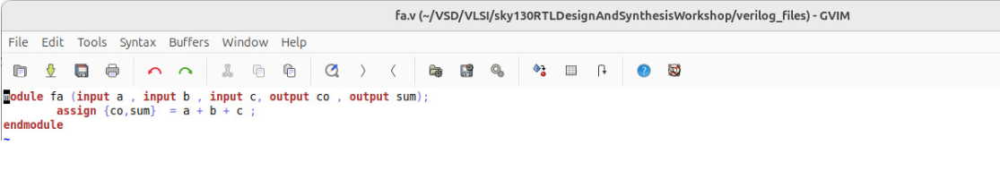

### Ripple Carry Adder (RCA)

This is an **8-bit ripple carry adder** which instantiates the `full_adder` module **8 times** using a `for-generate` loop.

RTL Code of RCA:
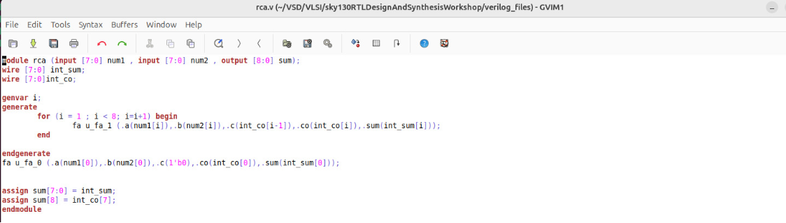

Simulation Output of RCA:
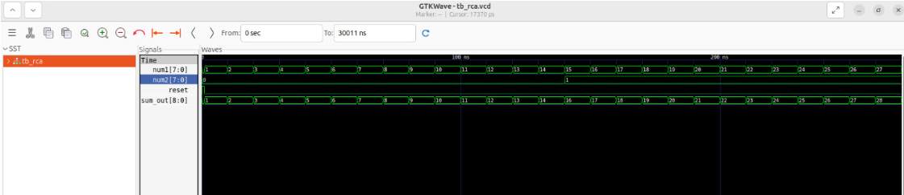

Synthesized Hardware of RCA:
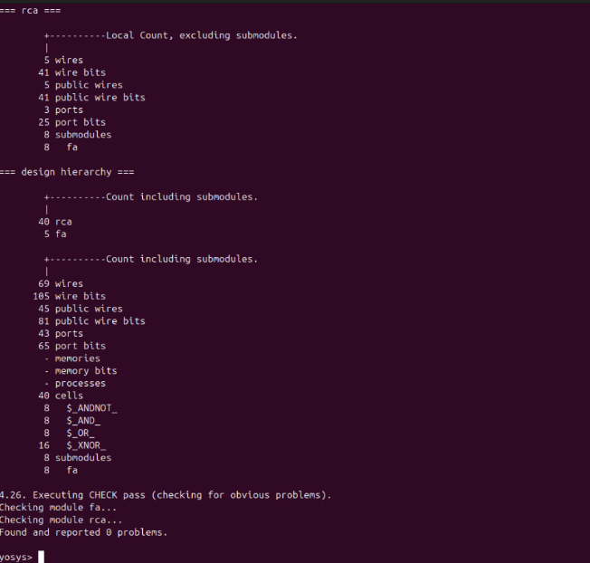

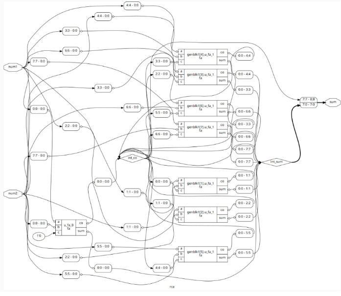

---

## 2. Multiplexer using For-Generate (`mux_generate.v`) 💡

This example shows the implementation of a **4-to-1 MUX** using the `generate` construct.

If we were designing a higher-order MUX (e.g., 32-to-1) using a regular `case` statement, we would need to manually write all possible combinations, making the process tedious. Using `generate` simplifies and makes the design scalable and efficient.

RTL Code of MUX (Generate):
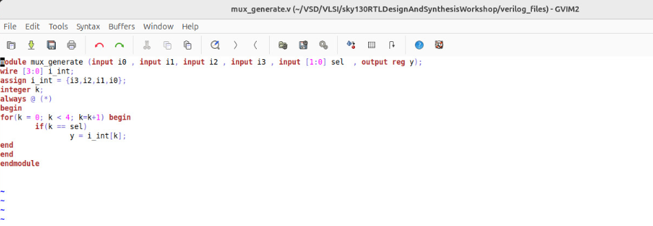

Simulation Output of MUX (Generate):
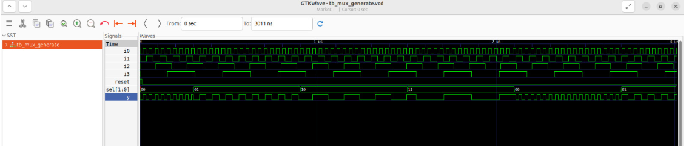

---

## 3. Demultiplexer Implementations

### Demultiplexer using For-Generate (`demux_generate.v`)

Using the `generate` looping construct made the Demultiplexer code **efficient and simple**, especially for scalable designs.

RTL Code of DEMUX (Generate):
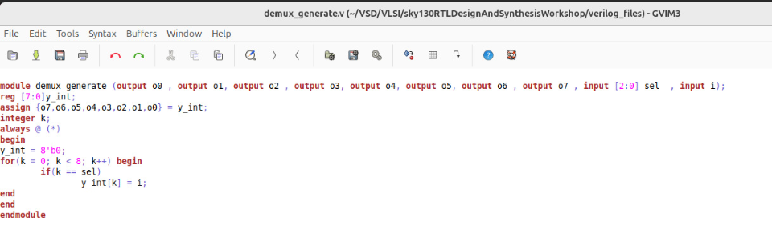

Simulation Output of DEMUX (Generate):
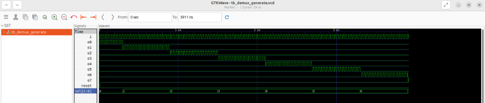

### Demultiplexer using Case Statement (`demux_case.v`)

In this case, a standard `case` statement was used for the demultiplexer. While the code is clean and readable for a small-scale demux, the problem is that designing a **higher-order demux** using this approach would be **tedious** to write and maintain.

RTL Code of DEMUX (Case):
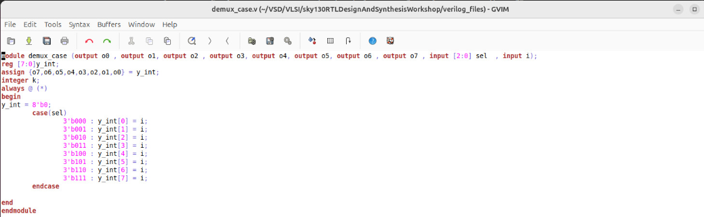

Simulation Output of DEMUX (Case):
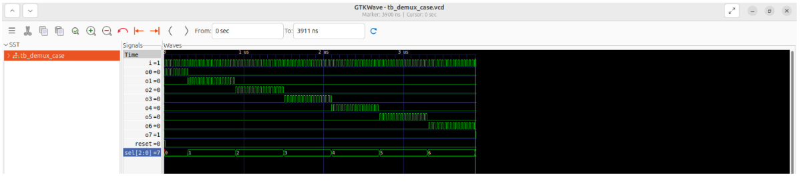

---

## Observations and Key Takeaways

* **`for` loops inside `always` blocks** are useful for iterative **behavioral assignments** (e.g., clearing an array or assigning sequential values).
* **`for-generate` constructs** are **essential** for **structural hardware instantiation** and creating conditional or iterative connectivity.
    * **Example:** The **Ripple Carry Adder (RCA)** instantiates multiple Full Adders efficiently using `for-generate`.
    * **Example:** Designing scalable MUX/DEMUX logic becomes simple and efficient with `for-generate`, avoiding tedious, repetitive code required by large `case` statements.

✅ With these labs, we completed **Day 5, Subdivision 5**, and observed how `for` and `for-generate` simplify repetitive instantiations, improve code reusability, and ensure correct mapping during synthesis.